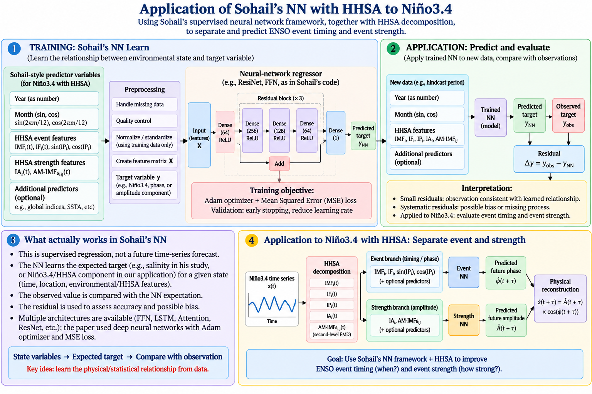
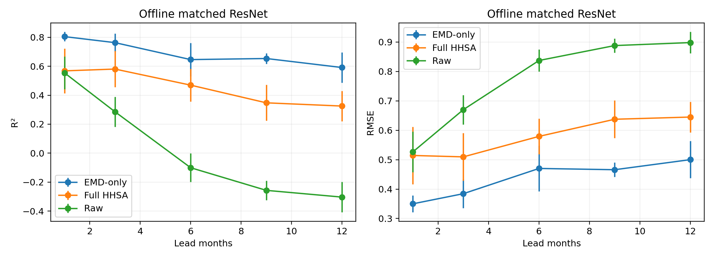
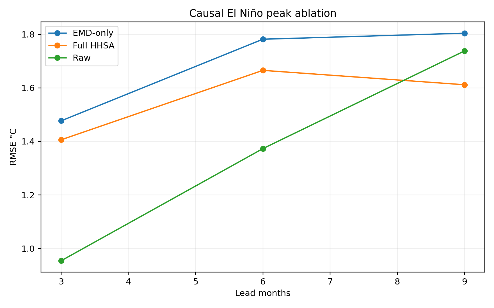
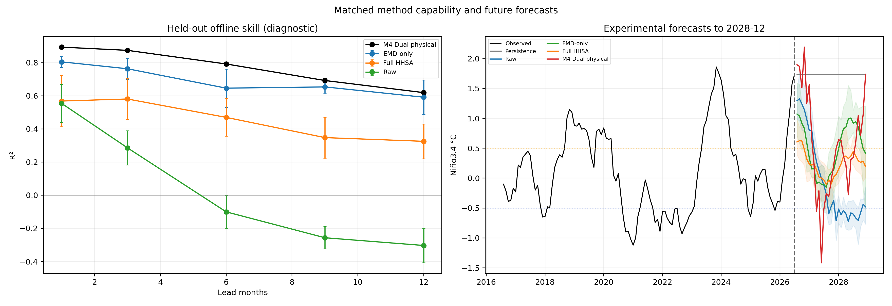

# Niño3.4 Forecasting with Raw, EMD, and HHSA State Representations

[](https://doi.org/10.5281/zenodo.22884201)

## Purpose

This project tests whether EMD or full Hilbert–Huang spectral analysis (HHSA) adds predictive information beyond the raw Niño3.4 time series.

The primary matched comparison uses:

1. **Raw Sohail ResNet** — raw Niño3.4 lags;
2. **EMD-only Sohail ResNet** — first-level IMFs and residual;
3. **Full-HHSA Sohail ResNet** — IMFs, instantaneous amplitude, instantaneous frequency, and phase phasors.

Persistence is retained as a non-neural baseline. A separate **Dual-HHSA physical reconstruction** is retained as an additional interpretable experiment. The earlier M0–M5 labels are no longer used as the primary terminology because they mixed baselines, intermediate branches, and final forecasts.

## Relation to Sohail et al.

The matched neural network follows the dense residual-network pattern in Sohail, Zika, and Ehmen, *How accurate are salinity measurements around Antarctica? A machine learning based approach*, **Machine Learning: Earth**, DOI: [10.1088/3049-4753/ae7113](https://doi.org/10.1088/3049-4753/ae7113).

The accompanying code and data are archived at Zenodo DOI: [10.5281/zenodo.14010532](https://doi.org/10.5281/zenodo.14010532).

Sohail et al. did not develop an ENSO or HHSA forecasting system. This project adapts their state-vector, dense feed-forward, residual-block, cyclic-coordinate, Adam/MSE, and early-stopping concepts. The EMD/HHSA inputs, timing/strength separation, physical synthesis, causal hindcasts, and Niño3.4 application are specific to this project.

## Data

- Monthly Niño3.4 anomaly, °C;
- January 1948–July 2026;
- 943 samples and no missing values;
- local input: `data/nino34_monthly.csv`;
- 12 samples per year.

No replacement Niño3.4 dataset was downloaded.

## EMD and HHSA

The project uses the existing local MATLAB-port masking-EMD and direct-quadrature implementation, not the unrelated third-party `emd` package.

$$
x(t)=\sum_{i=1}^{6}IMF_i(t)+r(t)
$$

$$
IMF_i(t)=A_i(t)\cos\phi_i(t)
$$

$$
f_i(t)=\frac{1}{2\pi}\frac{d\phi_i(t)}{dt}
$$

There are six oscillatory IMFs and one residual. `upsample_level=0` is used so that the decomposition reconstructs without dropping the first high-frequency mode.

## Primary matched methods

### Raw Sohail ResNet

The input is a 60-month raw Niño3.4 window:

$$
[x(t-59),\ldots,x(t)].
$$

### EMD-only Sohail ResNet

The input contains 60-month histories of the six IMFs and residual:

$$
[IMF_1,\ldots,IMF_6,r]_{t-59:t}.
$$

It does not use instantaneous amplitude, frequency, or phase.

### Full-HHSA Sohail ResNet

The input contains first-level HHSA information:

$$
[IMF_i,A_i,f_i,\cos\phi_i,\sin\phi_i,r]_{t-59:t}.
$$

Second-level AM-IMFs are excluded from this matched comparison. This isolates the incremental value of first-level Hilbert information beyond EMD.

### Identical model and dimension

Every representation is standardized with training data only and projected to 60 dimensions using training-only PCA. All three then use exactly the same Sohail-style dense residual network:

```text
60 inputs
→ Dense(64)
→ 3 × [Dense(256) → Dense(128) → Dense(64) + skip connection]
→ multi-lead Niño3.4 output
```

Offline tests use seeds 42, 52, 62, 72, and 82. Causal event tests use the first three seeds.

## Additional Dual-HHSA physical reconstruction

This separate experiment predicts event timing and amplitude strength in different branches. The event network predicts phase phasors from IMF, frequency, and phase histories. Individual strength networks predict second-level amplitude components:

$$
A_i(t)=\sum_j AMIMF_{ij}(t)+r_i^{AM}(t).
$$

The outputs are physically recombined:

$$
\widehat{IMF}_i(t+k)=\widehat A_i(t+k)\cos\widehat\phi_i(t+k)
$$

$$
\widehat x(t+k)=\sum_{i=1}^{6}\widehat{IMF}_i(t+k)+\widehat r(t+k).
$$

This is an additional model, not part of the architecture-matched Raw/EMD/Full-HHSA test.



## Experimental design

### Offline diagnostic

The chronological split is 70% training, 15% validation, and 15% test. Scaling and PCA are fit on training data only. EMD/HHSA is nevertheless calculated on the full record before splitting, so these results are diagnostic rather than real-time.

### Causal-prefix El Niño test

For the held-out 2015, 2018, 2020, and 2023 El Niño peaks, the record is truncated at each 3-, 6-, and 9-month forecast origin. EMD/HHSA and training use only that prefix. Three seed predictions are averaged within each event before summary skill is calculated. The independent sample size is four events, not twelve seed-event combinations.

## Matched offline results

Mean test-set R² across five seeds:

| Lead | Raw | EMD-only | Full HHSA |
|---:|---:|---:|---:|
| 1 month | 0.554 | **0.805** | 0.568 |
| 3 months | 0.286 | **0.763** | 0.581 |
| 6 months | -0.100 | **0.646** | 0.470 |
| 9 months | -0.257 | **0.653** | 0.348 |
| 12 months | -0.303 | **0.591** | 0.325 |

EMD-only is strongest at every offline lead. Full HHSA outperforms Raw at 3–12 months, but amplitude, frequency, and phase do not improve on EMD-only.



## Matched causal event results

Peak-amplitude RMSE after averaging seeds within each of four independent events:

| Lead | Raw | EMD-only | Full HHSA |
|---:|---:|---:|---:|
| 3 months | **0.947** | 1.462 | 1.388 |
| 6 months | **1.359** | 1.766 | 1.654 |
| 9 months | 1.710 | 1.790 | **1.579** |

Raw is best at 3 and 6 months. Full HHSA is best at 9 months, but all errors are large and only four events are available. The offline EMD advantage does not transfer reliably to causal event prediction.



## Forecasts through December 2028

The comparison figure contains historical held-out R² and future forecasts for Persistence, Raw, EMD-only, Full HHSA, and Dual-HHSA physical reconstruction. Raw, EMD-only, and Full HHSA show five-seed means and seed ranges.



December 2028 point forecasts are:

| Method | Niño3.4 anomaly |
|---|---:|
| Persistence | 1.730 °C |
| Raw Sohail ResNet | -0.478 °C |
| EMD-only Sohail ResNet | 0.416 °C |
| Full-HHSA Sohail ResNet | 0.194 °C |
| Dual-HHSA physical reconstruction | 1.739 °C |

Future trajectories cannot establish which method is correct until observations become available. Historical offline skill favors EMD-only among the matched models, but this preference is provisional because EMD-only does not win the causal event test.

## Interpretation

1. EMD provides a strong offline representation advantage over Raw.
2. First-level Hilbert amplitude/frequency/phase adds offline skill over Raw, but not over EMD-only.
3. Neither EMD nor Full HHSA has a stable advantage in the four-event causal test.
4. Full-record decomposition leakage, endpoint effects, and cross-origin mode instability remain plausible explanations for the offline/causal difference.
5. This project does not yet demonstrate operational forecast improvement from HHSA.

## Robustness limitations

- Full-record decomposition can transfer future boundary information into offline features.
- Historical training samples inside a causal prefix do not each receive their own rolling decomposition.
- Only four independent held-out El Niño events are available.
- Cross-origin IMF mode matching is not implemented.
- Future seed ranges are not calibrated confidence intervals.
- Dataset provenance and anomaly baseline require formal documentation before journal submission.

## Reproduction

```bash
export OMP_NUM_THREADS=1
export MKL_NUM_THREADS=1
export OPENBLAS_NUM_THREADS=1

python src/run_raw_emd_hhsa_ablation.py
python src/forecast_method_comparison.py
```

The additional Dual-HHSA experiment is reproduced with:

```bash
python src/run_dual_hhsa.py
python src/run_causal_events.py
python src/forecast_future.py
```

## Principal outputs

- `results/raw_emd_hhsa_offline_summary.csv`
- `results/raw_emd_hhsa_causal_summary.csv`
- `results/raw_emd_hhsa_causal_event_means.csv`
- `results/future_method_comparison_to_2028_12.csv`
- `results/raw_emd_hhsa_ablation_metadata.json`
- `figures/04_dual_hhsa_forecast_to_2028_12.png`
- `figures/07_raw_emd_hhsa_offline_ablation.png`
- `figures/08_raw_emd_hhsa_causal_ablation.png`

Legacy Dual-HHSA branch metrics and model weights are retained for provenance, but they are not the primary matched comparison.

## References

1. Sohail, T., Zika, J. D., and Ehmen, T. *How accurate are salinity measurements around Antarctica? A machine learning based approach*. **Machine Learning: Earth**. DOI: [10.1088/3049-4753/ae7113](https://doi.org/10.1088/3049-4753/ae7113).
2. Sohail, T. (2024). *Machine learning-based quality assessment of Antarctic margins salinity — code, data and figures*, Version 1.0. Zenodo. DOI: [10.5281/zenodo.14010532](https://doi.org/10.5281/zenodo.14010532).
3. Huang, N. E., Shen, Z., Long, S. R., et al. (1998). The empirical mode decomposition and the Hilbert spectrum for nonlinear and non-stationary time series analysis. *Proceedings of the Royal Society A*, 454, 903–995. DOI: [10.1098/rspa.1998.0193](https://doi.org/10.1098/rspa.1998.0193).
